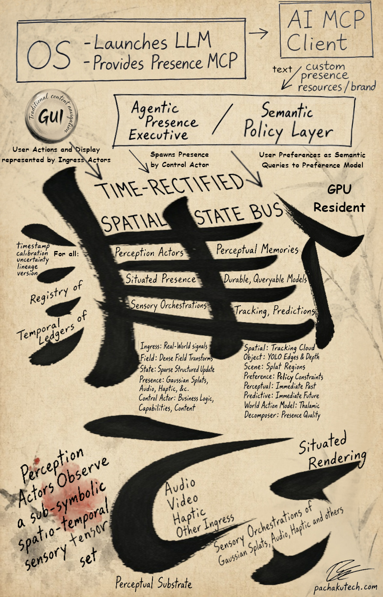

# Pachakutech Presence — an MCP Binding for the Presence Layer

Not another agent harness! A **Presence Layer**: a small, typed, policy-gated
set of actions — Manifestations — through which an agent can put sensory
stimuli directly into your UI instead of only describing it in text. This
package allows AI to instantiate that avatar in the user space through an
MCP Binding and a presence daemon evaluating a time-rectified sensory perception:
the Eros for LLM/AI Logos to learn by.

## The contract

| Tool | Pattern | Does |
|---|---|---|
| `manifestHighlight` | ephemeral | Highlights described on-screen content for N seconds |
| `spawnPresence` | instanced (1/3) | Spawns a persistent audio-visual presence derived from context (optionally from a held artifact), returns a `presenceId` |
| `animatePresence` | instanced (2/3) | Feeds new content to a spawned presence |
| `retirePresence` | instanced (3/3) | Ends a presence and frees its slot |
| `addArtifact` | instanced (1/2) | Adds a Gaussian splat cloud to the substrate as reference material — held, not rendered directly, for `spawnPresence` to build from |
| `retireArtifact` | instanced (2/2) | Removes a held artifact and frees its slot |

Every call passes a Policy Gate first: a 1.5s minimum interval between calls
to the same tool (except `retirePresence` / `retireArtifact`, which are
never rate-limited), a cap of 3 concurrent presences, a cap of 20 held
artifacts — presences and artifacts are capped independently since they're
different risk classes (one is actively rendered, the other is inert content
sitting in the substrate).

Full schemas are in [`src/index.ts`](src/index.ts); the reasoning behind the
ephemeral/instanced split, why artifacts are a separate registry from
presences, and why the tool *list* stays fixed while what each tool generates
remains versatile is in [`skills/presence/SKILL.md`](skills/presence/SKILL.md).
A one-page version of this contract, formatted for printing/sharing, is in
[`docs/contract-onepager.html`](docs/contract-onepager.html).

## Install — Linux x86_64

```bash
npm install -g @pachakutech/presence-mcp
presence doctor
presence daemon start
presence setup claude
```

`@pachakutech/presence-mcp` is one package. It includes the Node MCP binding,
the `presence` CLI, and a prebuilt Linux x86_64 `presence-daemon`. You do not
need Rust or Cargo, and install does not compile or start anything.

`presence setup claude` runs `claude mcp add presence -- presence mcp`.
`presence setup codex` and `presence setup grok` do the equivalent for Codex
and Grok CLI. Your agent client then launches `presence mcp` over stdio. That
process talks to the daemon on a local Unix socket
(`$XDG_RUNTIME_DIR/pachakutech/presence.sock`).

The daemon is a separate process. It owns the Wayland and Vulkan integration
and runs only in a logged-in Linux desktop session, as that user, never as
root. Start it yourself with `presence daemon start`. Stop it with
`presence daemon stop`. `presence doctor` is the diagnostic.

npm can ship the executable. It cannot ship the host session:

- Linux x86_64.
- A Wayland desktop session (`WAYLAND_DISPLAY`).
- A Vulkan loader and a vendor driver.
- GPU render-node access (`/dev/dri/renderD128`).
- Webcam access only when webcam features are used.
- Hyprland is the reference compositor.

On a machine with no Vulkan driver the daemon prints a clear error and exits.
On a working desktop it reports the GPU name and dma_buf support, runs a
one-splat compute smoke tick (fatal if dispatch fails), then listens on the
socket above. `presence daemon path` prints the bundled binary it will launch.
Stdout and stderr from that process go to
`$XDG_RUNTIME_DIR/pachakutech/presence-daemon.log`.



## Updating

Presence does not auto-update.

Check for available global npm updates:

```bash
npm outdated -g --depth=0
```

Update Presence:

```bash
npm update -g @pachakutech/presence-mcp
```

Restart the local daemon after updating:

```bash
presence daemon restart
```

Confirm installed versions:

```bash
presence --version
presence daemon status
```

On Omarchy, [`docs/omarchy.md`](docs/omarchy.md) describes a planned
`omarchy-mise-install` line. That path is not verified yet. The npm install
above is the one to use.

## Building from source — contributors

Rust and Cargo are required only when building the daemon from this
repository. A normal npm install uses the bundled binary.

Shader compile needs `glslangValidator` at build time (Arch/Omarchy: `glslang`).
Run time needs `vulkan-icd-loader` and a vendor driver (`vulkan-intel`,
`vulkan-radeon`, or `nvidia-utils`).

```bash
git clone https://github.com/Pachakutech/pachakutech-situated-ai-presence-mcp.git
cd pachakutech-situated-ai-presence-mcp
npm install
npm run prepare:package   # tsc, cargo build --release, copy into native/linux-x64
npm link                  # puts `presence` on your PATH from this checkout
```

`prepare:package` means "assemble what the tarball contains." It is not a
second npm package. `npm publish` runs it via `prepublishOnly`. `npm install`
does not.

See [`daemon/README.md`](daemon/README.md) for the overlay and ingress
details. The daemon presents a 220×220 layer-shell disc
(`exclusive_zone = -1`). Do not leave an older fullscreen-capture build
running; that exhausted Hyprland's memory.

## Where this runs, and what it needs access to

The MCP server is **local** — spawned as a subprocess of your agent CLI, on
your machine, over stdio. There is no cloud round-trip and nothing to
authenticate; the same reason this differs architecturally from something
like Astra is that there's no server to stand up and no session to hand
over. Because your agent CLI runs inside your own logged-in desktop session,
the MCP server it spawns inherits that session's environment automatically —
`WAYLAND_DISPLAY`, `XDG_RUNTIME_DIR`, `DBUS_SESSION_BUS_ADDRESS` — with no
separate setup step, unlike a systemd service, which would need its
environment imported explicitly.

If the daemon isn't running, `src/daemonStub.ts` only calls
`notify-send` and appends to a log file, so the only real dependency is
Node. If the daemon *is* running, the Binding talks to it over the Unix
socket and those session variables matter.

**The daemon** needs two more things, both standard on a modern desktop
session and checked by `presence doctor`:
- **GPU access**, via the DRM render node (`/dev/dri/renderD128`) — for
  Vulkan. On most current distros this is granted automatically to whoever
  is logged in at the console, through `systemd-logind`'s dynamic ACLs, not
  through group membership. If it isn't, adding your user to the `render`
  group fixes it.
- **Webcam access**, via `/dev/video*` — gated by the `video` group on most
  distros. Desktop users are typically in this group already; worth knowing
  explicitly, since a missing webcam permission fails silently rather than
  with a clear error.

Neither requires root, a privileged daemon, or a setup wizard — just the
ordinary permissions of an interactively logged-in desktop user.

A packaging note: this has no dependency on Arch/pacman specifically, or on
any particular init system. If a distro's packaging base changes, none of the
above changes with it — Hyprland has full first-class support under NixOS
and Home Manager as of today, so a Nix-based distro would run this exactly
the same way.

## What's real vs. stubbed right now

The MCP surface — schemas, Policy Gate, CLI, and the Unix-socket client —
is real. With `presence-daemon` up, tool calls hit the Rust registry; without
it, they hit `notify-send` plus `~/.local/state/pachakutech-presence/log.jsonl`.
The daemon owns a Vulkan device and a compute splat pipeline that smokes on
startup, and it presents a 220×220 layer-shell disc on Hyprland. Screen
ingress imports a dmabuf when the device and compositor allow it, and
otherwise falls back to a shared-memory copy at about 10 fps. `addArtifact`'s
`sourceUri` is a local `.splat`/`.ply` path the daemon reads from disk —
description-only holds an empty cloud. The boundary is deliberate: the daemon owns the GPU,
the MCP layer owns the contract, and they talk over a small, typed protocol
rather than sharing buffers. See [`docs/architecture.md`](docs/architecture.md).

## Why this exists

Every agent CLI today speaks fluently in files, shells, and text. None of
them have a vocabulary for situational presence — putting something *into
the user's perception* — a highlight, a persistent character, a spatial cue
— governed by the same kind of explicit, inspectable contract you'd expect
from any other tool call. This is that vocabulary, built as an open MCP
server rather than a pitch deck, because the fastest way to have this
conversation with anyone is to hand them something that already runs.

This isn't an attempt to out-cloud Google's Astra — it's a different
starting point aimed at a different person: someone already running an
open-weight model locally (Llama, Gemma, Qwen — whatever), who right now has
no way to give that model a body. No persistent perceptual memory, nothing
it can manifest into their space, nothing past a text prompt. That's the gap
this fills: a common, open-source, local-first, open-weight-model-ready
multimodal presence layer, starting on Linux. See
[`docs/vision.md`](docs/vision.md) for the fuller version of why, including
where this is headed if local models keep closing the gap with cloud ones.

MIT licensed. Contributions and forks welcome, at
[github.com/Pachakutech/pachakutech-situated-ai-presence-mcp](https://github.com/Pachakutech/pachakutech-situated-ai-presence-mcp).
